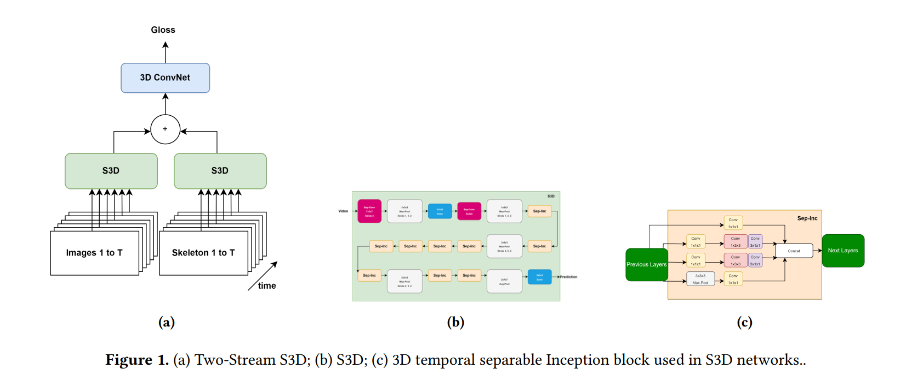

# Two Stream S3D Architecture for Word Level Sign Language Recognition


## Introduce

This repository accompanies the paper [Two Stream S3D Architecture for Word Level Sign Language Recognition](https://dl.acm.org/doi/10.1145/3654522.3654559). The article addresses sign language recognition at the word level based on the Separable 3D CNN (S3D) model. We propose a low-cost model because we recognize the potential for future use of identification systems on handheld devices. We have conducted experiments on many different data sets and achieved the expected results.

## Abstract

In this study, we introduce a word-level sign language recognition (SLR) method, using the Two Stream S3D (TSS3D) model. Our goal was to develop a compact, highly accurate model that addresses practical limitations related to the time and effort required to learn sign language. Recognizing the importance of implementing SLR on handheld devices, we aim to facilitate communication between deaf and non-hearing people without the need for them to be proficient in sign language signals. Our method combines both RGB data and skeleton data, with each data type processed through separate S3D streams, the two data types will be combined, and a 3D convolution layer to make the final prediction. Despite TSS3D's modest size, with just over 16 million parameters, the combination of RGB and skeleton methods offers specific advantages because they complement each other. RGB data enhances the model's ability to adapt to varying lighting conditions and complex backgrounds, while frame data allows the model to prioritize action recognition, minimizing interference from external factors. Integrating information from both data sources enhances TSS3D's performance, surpassing some larger models. We use accuracy as a metric and evaluate our model on three separate datasets: LSA64, which includes 3200 videos with 64 Argentine Sign Language terms; AUTSL, a Turkish Sign Language dataset with 38,336 videos containing 226 different Turkish Sign Language terms; and WLASL, an American Sign Language dataset created by deaf people or interpreters. Our results demonstrate 99.38% accuracy on the LSA64 dataset and 93.75% on the AUTSL dataset.


## Two Stream S3D Architecture



## Dataset

We tested on three different datasets including: [Large-Scale Multimodal Turkish Signs (AUTSL)](https://ieeexplore.ieee.org/abstract/document/9210578), [Large-Scale Dataset for Word-Level American Sign Language (WLASL)](https://github.com/dxli94/WLASL), and [A Dataset for Argentinian Sign Language (LSA64)](https://facundoq.github.io/datasets/lsa64/). You can explore and download the data on our link provided in this repository.

## Data Folder

To make it easier for you to use your custom data, we describe in detail the structure of the folder containing the data as follows:

```
WLASL_100/
│
├── test/
│   └── # Testing data goes here
│
├── train/
│   ├── africa/
│   ├── clothes/
│   ├── dark/
│   ├── give/
│   └── later/
│   └── # Training data is organized by class in separate folders
│
└── val/
    └── # Validation data goes here
```
## Installation
1. Clone the repository:
```bash
git clone https://github.com/justinvo277/Sign-Language-Recognition-.git
```

2. Navigate to directory:
```bash
cd Sign-Language-Recognition-
```

3. Install the required dependencies:
```bash
pip install -r requirements.txt
```
## Usage


